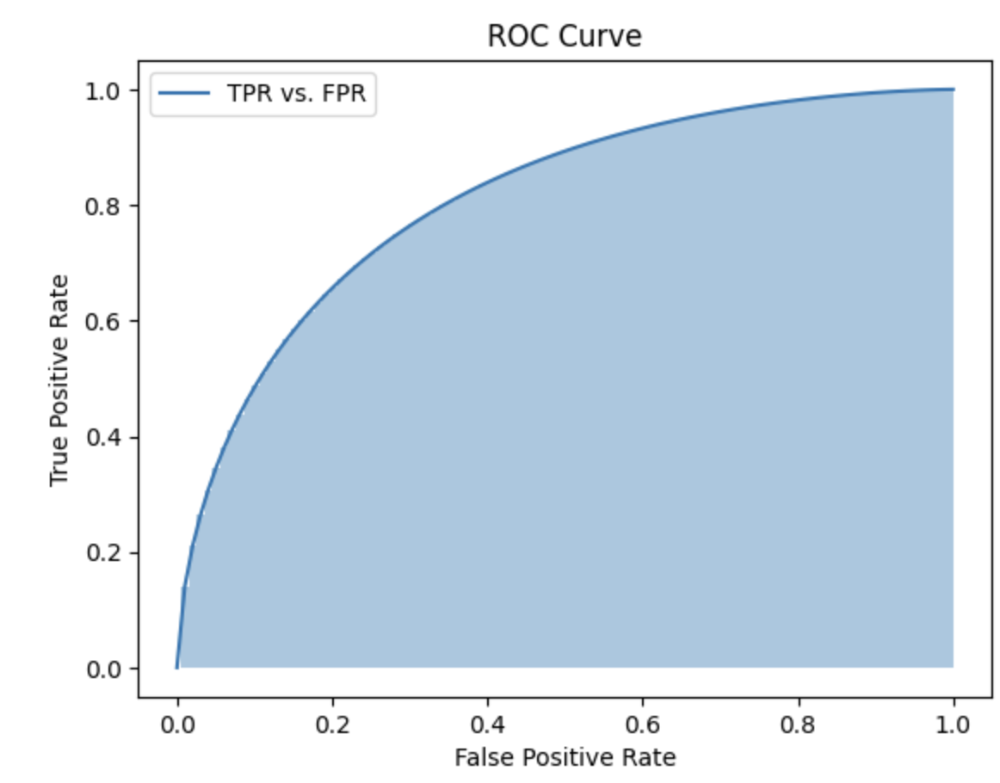
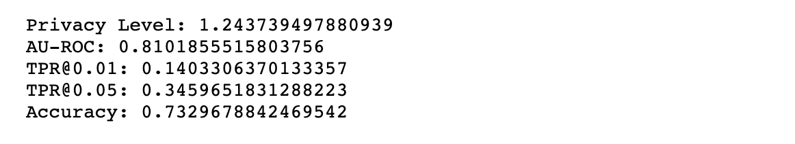
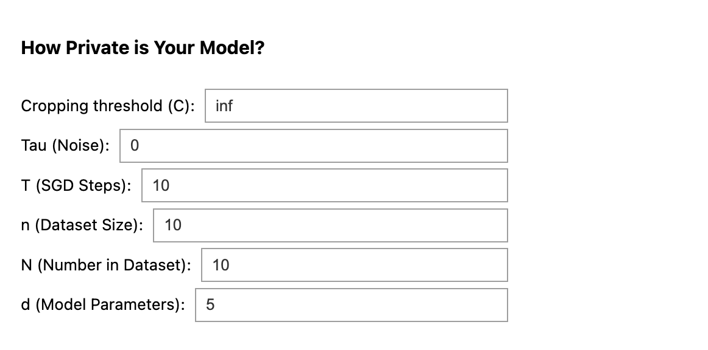

# Gaussian Membership Inference Privacy

This repository contains accompanying code for the paper [Gaussian Membership Inference Privacy](https://arxiv.org/abs/2306.07273) by Tobias Leemann*, Martin Pawelczyk*, and Gjergji Kasneci.

## Membership Inference Privacy Calculator: How Private is Your Model? 

<a href="https://colab.research.google.com/drive/1R3yqS8k9bOhxp3WPmOmBKUvrKPTGKLjs?usp=sharing"></a>

**Find out how private your model is!** Enter your models's parameters in our interactive calculator to valuate the maximal vulnerability of your model to membership inference attacks, and visualize the results using AU-ROC curve. No installation is required.

[Run on Google Colab](https://colab.research.google.com/drive/1R3yqS8k9bOhxp3WPmOmBKUvrKPTGKLjs?usp=sharing)

### Setup
The following steps are required to run the code in this repository using a dedicated anaconda environment.

### Creating an Anaconda Environment
Make sure you have a working installation of anaconda on your system and go to the main directory of this repository in your terminal.
Then install the requirements into a new conda environment named ```gaussian_mip``` by running the following commands 
```
conda env create -f environment.yml
```
Then run
```
conda activate gaussian_mip
```

### Add new environment to Jupyter notebook.
The attack experiment is implemented in ```notebooks/GLiRAttack.ipynb```. To add the kernel to an existing jupyter installation, activate the ```gaussian_mip``` python kernel and run

```
python -m ipykernel install --user --name gaussian_mip
```

### Downloading datasets
The adult dataset is included in this repository and CIFAR-10 is available via pytorch. To download the purchase dataset, run the script
```
./tabular/download_datasets.sh
```

## Gradient Likelihood Ratio (GLiR) attack

In our work, we present a novel membership inference attack. In Figure 2 of our paper, we run this attack on models that were trained with the train script ```train_scripts/train_models_audit.py <dataset>```. See the notebook ```notebooks/GLiRAttack.ipynb``` for the full code of the attack and more details on how to run it on the trained models.

## Utility Considerations

To reproduce our experiment on the utility of Membership Inference Private models vs. Differentially Private models, please consider the notebook ``notebooks/UtilityConsiderations.ipynb``. To create the utility plot, it is first required to train corresponding models using the script ``train_scripts/train_models_util.sh <dataset>``, which takes a single argument that defines the dataset (currently supported are "adult", "purchase", "cifar10"). Run the script for all three datasets to recreate the plots. Further instructions can be found in the notebook.

## Computations Notebook
This notebook is designed for readers interested in assessing their privacy levels within data-driven systems. Through practical Python implementations, you'll be able to calculate statistical metrics, evaluate your vulnerability to membership inference attacks, and visualize the results using AU-ROC curve.

https://colab.research.google.com/drive/1M5gvbB29Wn3k6pxkmcMJCDVbBh7kLkiO?usp=sharing

<table>
  <tr>
    <!-- Image Cell 1 -->
    <td style="vertical-align: top;">
      
    </td>
    <!-- Image Cell 2 -->
    <td style="vertical-align: top;">
      
    </td>
    <!-- Image Cell 3 -->
    <td style="vertical-align: top;">
      
    </td>
  </tr>
</table>


## Reference
If you find our work or the ressources provided here useful, please consider citing our work, for instance using the following BibTeX entry:

```
@InProceedings{leemann2023gaussian,
  title     = {Gaussian Membership Inference Privacy},
  author    = {Leemann, Tobias and Pawelczyk, Martin and Kasneci, Gjergji},
  booktitle = {37th Conference on Neural Information Processing Systems (NeurIPS)},
  year      = {2023}
}
```

# Is My Data Safe? Predicting Instance-Level Membership Inference Success for White-box and Black-box Attacks
The repository additionally contains code for extenting the attack to more realistic datasets and models such as BERT and a skin cancer prediction dataset as presented in the ICML workshop paper.

Please refer to the workshop paper for more details and use the following BibTeX key to cite it:

```
@InProceedings{leemann2024data,
  title     = {Is My Data Safe? Predicting Instance-Level Membership Inference Success for White-box and Black-box Attacks},
  author    = {Leemann, Tobias and Prenkaj, Bardh and Kasneci, Gjergji},
  booktitle = {ICML 2024 Workshop on the Next Generation of AI Safety},
  year      = {2024}
}
```


